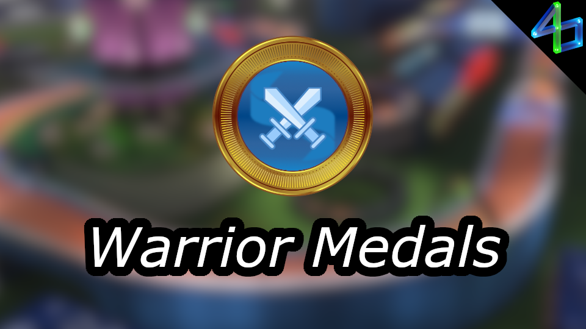

# Warrior Medals

Are author medals too easy for you, but Champion medals still seem out of reach? Do you need something in-between?

This is of course inspired by the [Champion Medals](https://openplanet.dev/plugin/championmedals) plugin. Warrior medals are available for every official campaign (including training and the TMO discoveries), Weekly Shorts (first year), and every Track of the Day. Warrior medals may also be added for club campaigns by request from the campaign's author/maintainer. [Message me on Discord](https://discord.gg/uu9kUZGte6), [create a GitHub issue](https://github.com/ezio416/tm-warrior-medals/issues), or message me directly from the plugin to request Warrior medals for your campaign. Check all Warrior medal times on [my website](https://e416.dev/warrior-medals)!

Medals may be manually adjusted due to physics changes or for being more difficult than they should be. [Message me on Discord](https://discord.gg/uu9kUZGte6), [create a GitHub issue](https://github.com/ezio416/tm-warrior-medals/issues), or message me directly from the plugin if you feel like a Warrior medal does not make sense in some way. Do not ask for Warrior medals to be harder - grind for the Champion medal instead.

This plugin, like all of mine, is licensed under [MIT](https://opensource.org/license/mit), which is one of the most lenient. You may also use Warrior medal data in whichever way you like without permission, though if you want to get it directly from my API, please at least discuss it with me first so we can work out a good solution for your needs.

Seasonal Campaigns:
-
- 2 weeks after the season starts
- 1/4 of the way between author and world record
- examples:

    |Map             |World Record|Warrior |Author  |
    |:-:             |:-:         |:-:     |:-:     |
    |Summer 2024 - 01|22.325      |23.524  |23.923  |
    |Summer 2024 - 25|1:07.943    |1:09.746|1:10.347|

Weekly Shorts:
-
- when leaderboards are revealed (1 week after release)
- 1/2 of the way between author and world record
- discontinued after week 52
- examples:

    |Map                |World Record|Warrior|Author |
    |:-:                |:-:         |:-:    |:-:    |
    |First (#1)         |16.005      |16.819 |17.632 |
    |Not Cut Proof (#37)|9.244       |12.192 |15.139 |

Tracks of the Day:
-
- 2 hours after the track releases (21:00 CET)
- if someone has author by at least 8ms:
    - 1/8 of the way between author and world record
    - otherwise 1 ms faster than author
- does not account for Champion medal times, so it may be equal or faster
- examples (arbitrarily chosen values):

    |World Record|Warrior|Author|
    |:-:         |:-:    |:-:   |
    |44.926      |45.584 |45.678|
    |40.069      |39.999 |40.000|

Club campaigns:
-
- when I have time after someone requests medals for a campaign
- unless decided otherwise, medal will be halfway between author and world record (same as Weekly Shorts)

Function used for calculation:
-
```Python
def calc_warrior_time(author_time: int, world_record: int, factor: float | None = 0.25) -> int:
    '''
    - `factor` is offset from AT
        - between `0.0` and `1.0`
        - examples, given AT is `10.000` and WR is `8.000`:
            - `0.000` - AT (`10.000`)
            - `0.125` - 1/8 of the way between AT and WR (`9.750`) (tracks of the day)
            - `0.250` - 1/4 of the way between AT and WR (`9.500`) (seasonal campaigns)
            - `0.500` - 1/2 of the way between AT and WR (`9.000`) (weekly shorts/club campaigns)
            - `0.750` - 3/4 of the way between AT and WR (`8.500`)
            - `1.000` - WR (`8.000`)
    '''

    return author_time - max(
        int((author_time - world_record) * (factor if factor is not None else 0.25)),
        1
    )
```

Exports:
-
Please use this plugin as a dependency! While it's useful on its own, I would love to see integration in some more popular plugins. Include this in your `info.toml`: `optional_dependencies = [ "WarriorMedals" ]`

`string GetColorWarriorStr()`\
`vec3 GetColorWarriorVec()`\
Returns the plugin's main color as a string or a vec3.

`const UI::Texture@ GetIconWarrior32()`\
`const UI::Texture@ GetIconWarrior512()`\
Returns the Warrior medal icon with a size of 32x32 or 512x512.

`const dictionary@ GetMaps()`\
Returns all cached map data.\
Keys are map UIDs and values are of type `WarriorMedals::Map@`.

`uint GetWMTime()`\
`uint GetWMTime(const string &in uid)`\
Returns the Warrior medal time for the current map or given map UID.
If there is an error or the map does not have a Warrior medal, returns 0.
Does not query the API for a time, so the plugin must already have it cached for this to return a time.
Only use this if you need a synchronous function.

`uint GetWMTimeAsync()`\
`uint GetWMTimeAsync(const string &in uid)`\
Returns the Warrior medal time for the current map or given map UID.
If there is an error or the map does not have a Warrior medal, returns 0.
Queries the API for a medal time if the plugin does not have it cached.
Use this instead of the synchronous version if possible.

<!--  -->
<!--  -->
<!--  -->


